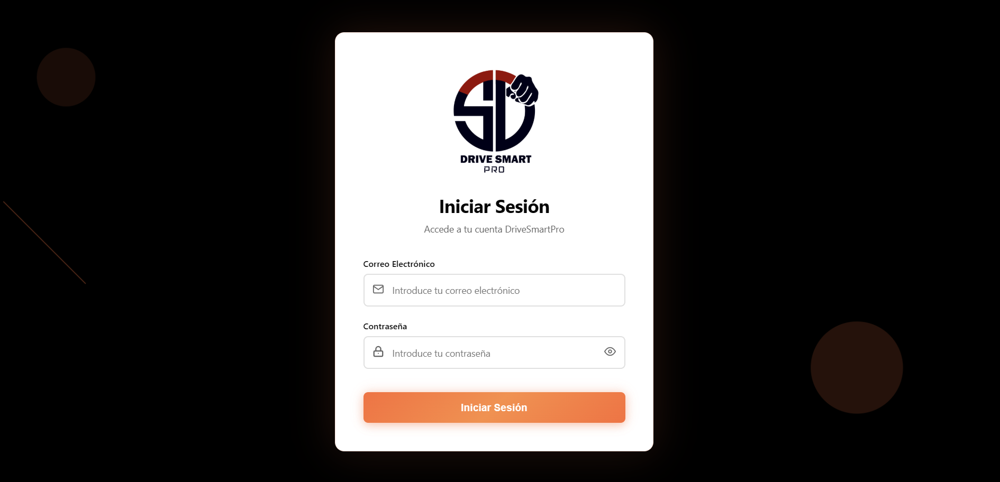
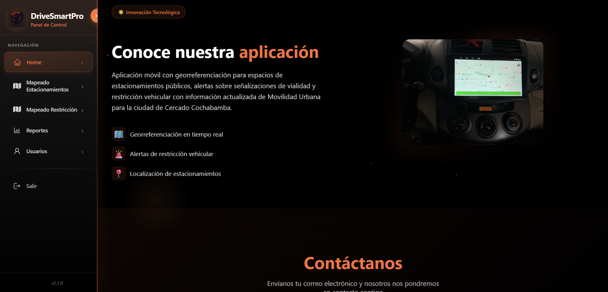

# 🚗 DriveSmart Web


Una aplicación web para gestionar estacionamientos inteligentes y brindar mapas interactivos con restricciones y reportes de uso.

---

## 📋 Tabla de Contenidos

* [Características](#-características)
* [Tecnologías](#-tecnologías)
* [Instalación](#-instalación)
* [Uso](#-uso)
* [Capturas](#-capturas)
* [Estructura de Carpetas](#-estructura-de-carpetas)
* [Licencia](#-licencia)

---

## ✨ Características

* Mapa interactivo con restricciones de estacionamiento.
* Creación y edición de capas GeoJSON.
* Reportes en tiempo real de disponibilidad de espacio.
* API en Node.js con conexión a PostgreSQL.

---

## 🛠 Tecnologías

* **Frontend:** React (Client)
* **Backend:** Node.js, Express, PostgreSQL (server)
* **Autenticación:** JWT
* **Gestión de Entorno:** dotenv
* **Mapas:** Leaflet

---

## 🔧 Instalación

1. Clona el repositorio:

   ```bash
   git clone https://github.com/Fernando-Estivariz/drivesmart-web.git
   cd drivesmart-web
   ```

2. Crea y configura variables de entorno:

   ```bash
   cp server/.env.example server/.env
   # Edita server/.env con tus credenciales
   ```

3. Instala dependencias:

   ```bash
   cd Client && npm install
   cd ../server && npm install
   ```

4. Levanta la aplicación en desarrollo:

   ```bash
   # Desde la raíz
   npm run start:client   # React client
   npm run start:server   # Backend Node
   ```

---

## 🚀 Uso

En tu navegador abre:

* Frontend: `http://localhost:3000`
* API: `http://localhost:4000`

---

## 📸 Capturas

<p align="center">
  
  
  
  
</p>

---

## 🗂 Estructura de Carpetas

```text
drivesmart-web/
├─ Client/
│  ├─ public/
│  ├─ src/
│  └─ package.json
├─ server/
│  ├─ .env.example
│  ├─ database.js
│  └─ server.js
├─ assets/
│  ├─ cover.png
│  └─ screenshot1.png
├─ .gitignore
└─ README.md
```

## 📄 Licencia

Este proyecto está bajo la licencia MIT. Consulta el archivo [LICENSE](./LICENSE) para más detalles.
